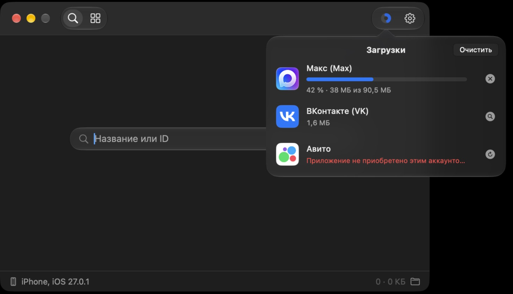

<div align="center">


# Pipa

**Скачивает приложения из App Store в `.ipa` и ставит их на iPhone по кабелю.**<br>
Всё в одном окне, на родном macOS — без Терминала и без танцев с бубном.

[](https://github.com/ukkvkkv/pipa/releases/latest/download/Pipa.dmg)

[](https://github.com/ukkvkkv/pipa/releases/latest)


[](LICENSE)



</div>

---

## Зачем это

Вернуть на iPhone приложение, которое **удалили из App Store** (банки, платёжные
сервисы, маркетплейсы) или которого **нет в регионе** твоего аккаунта, — если оно
когда-то было у тебя в покупках. Или скачать `.ipa` про запас, пока приложение
ещё в магазине.

Pipa скачивает установочный файл прямо с серверов Apple от имени твоего Apple ID
и ставит его на телефон. Никаких взломов: только то, на что у аккаунта есть права.

## Что умеет

|  |  |
|---|---|
| 🔎 **Поиск** | по названию или по ID из ссылки App Store |
| ⬇️ **Загрузка** | очередь, проценты и мегабайты по ходу, отмена и повтор |
| 🆓 **Бесплатные** | «Скачать» сам получает лицензию, если её ещё нет |
| 📚 **Библиотека** | все скачанные `.ipa`: версия, минимальная iOS, размер, аккаунт |
| 📱 **Установка** | на iPhone по USB одной кнопкой, с проверкой версии iOS |
| 👥 **Аккаунты** | несколько Apple ID, переключение в настройках |
| 🧊 **Liquid Glass** | на macOS 26 — стекло, на 14–15 — привычный интерфейс |

---

## Установка

1. Скачай **[Pipa.dmg](https://github.com/ukkvkkv/pipa/releases/latest/download/Pipa.dmg)**.
2. Открой его и перетащи **Pipa** в папку **Программы**.
3. Первый запуск. Pipa не нотаризована в Apple (это хобби-проект без платного
   аккаунта разработчика), поэтому macOS её сначала не пустит:
   - открой Pipa — появится предупреждение, нажми **Готово**;
   - **Системные настройки → Конфиденциальность и безопасность** → внизу
     **«Всё равно открыть»** → подтверди паролем.

   Или одной командой в Терминале:

   ```bash
   xattr -dr com.apple.quarantine /Applications/Pipa.app
   ```

Дальше Pipa открывается как обычно. Всё нужное — `ipatool`, `ideviceinstaller`
и их библиотеки — уже внутри, Homebrew ставить не надо.

> **Требования:** macOS 14 Sonoma или новее, любой Mac — Apple Silicon или Intel (сборка universal).

---

## Как пользоваться

### 1. Войти в Apple ID

Нажми **Войти…** и введи Apple ID и пароль — тот аккаунт, на котором числятся
нужные приложения. Apple попросит код подтверждения:

- он придёт на твои устройства всплывающим окном, или
- на iPhone: **Настройки → [твоё имя] → Вход и безопасность → Получить код проверки**.

> [!IMPORTANT]
> Если на аккаунте включены **аппаратные ключи безопасности**, вход не пройдёт —
> их придётся выключить.

Пароль Pipa не хранит: он передаётся напрямую в `ipatool`, а тот получает у Apple
токен сессии. Аккаунтов можно добавить несколько — **⚙︎ Настройки → Добавить аккаунт…**

### 2. Найти и скачать

Вкладка **🔎 Поиск**: введи название или числовой ID приложения (он есть в ссылке
`apps.apple.com/…/id1234567890`) и нажми **Скачать** справа от результата.

- Прогресс видно по кружку в панели сверху; клик по нему открывает список
  загрузок: проценты, мегабайты, отмена, повтор, «Показать в Finder».
- Правый клик по приложению: **Получить без загрузки** (только добавить в
  покупки), **Скопировать ID**, **Открыть в App Store**.
- Галочка ✓ у приложения — его уже скачивали с этого аккаунта.

Файлы ложатся в **`~/Pipa`**. Папку можно сменить в настройках.

> [!TIP]
> Лучше оставить папку вне «Документов», «Загрузок» и «Рабочего стола»: к ним
> macOS спрашивает доступ, и у неподписанного приложения это разрешение слетает
> с каждым обновлением.

### 3. Поставить на iPhone

1. Подключи iPhone кабелем и разблокируй его. При первом подключении ответь
   **«Доверять»** на телефоне.
2. Внизу окна появится имя телефона и версия iOS.
3. Вкладка **▦ Библиотека** → у нужного файла кнопка **На iPhone**.

Если приложению нужна iOS новее, чем на телефоне, кнопка будет неактивна.
Без кабеля тоже можно: отправь `.ipa` на iPhone через **AirDrop**, и он
установится сам.

---

## Вопросы

<details>
<summary><b>«Приложение не приобретено этим аккаунтом»</b></summary>

Apple отдаёт `.ipa` только тем аккаунтам, у которых приложение есть в покупках.
Бесплатные Pipa «покупает» сама, но только пока приложение ещё продаётся в
регионе твоего Apple ID. Если его убрали из магазина — скачать получится только
с аккаунта, который успел его получить раньше. Регион задаёт сам Apple ID, в Pipa
такой настройки нет.
</details>

<details>
<summary><b>«Сессия истекла — войдите в аккаунт заново»</b></summary>

Токен Apple живёт не вечно. **⚙︎ Настройки → Выйти**, затем войти снова с кодом.
</details>

<details>
<summary><b>Телефон не появляется внизу окна</b></summary>

Разблокируй iPhone, проверь, что ответил «Доверять», попробуй другой кабель или
порт. Установщик работает через тот же сервис, что Finder, так что если Finder
видит телефон — увидит и Pipa.
</details>

<details>
<summary><b>Можно ли поставить приложение на чужой iPhone?</b></summary>

`.ipa` из App Store привязан к Apple ID, с которого его скачали. Запустится он на
телефоне, где в App Store выполнен вход в этот же аккаунт (или после входа в него).
</details>

<details>
<summary><b>Безопасно ли давать пароль?</b></summary>

Pipa — открытый код, всё в этом репозитории. Пароль уходит только в `ipatool`,
а тот ходит только на серверы Apple. Сама Pipa ходит в сеть только за иконками приложений
(тоже к Apple) и за списком популярных приложений с GitHub.
</details>

---

## Сборка из исходников

Нужны только Xcode Command Line Tools (`xcode-select --install`) с macOS SDK 26.

```bash
./build.command
```

Получится `Pipa.app` рядом со скриптом. `./make_dmg.command` соберёт его же и
упакует в `Pipa.dmg`. Иконка рисуется кодом: `swift assets/draw_icon.swift assets/logo.png`.

`ideviceinstaller` и `ideviceinfo` лежат в `vendor/idevice/` готовыми — universal,
статически собранные для macOS 11+. Пересобрать их из исходников (при обновлении
версий): `brew install autoconf automake libtool pkg-config cmake`, затем
`vendor/idevice/build.sh`.

<details>
<summary>Что где лежит</summary>

```
Sources/Pipa/     интерфейс на SwiftUI и логика
  IPATool.swift     обёртка над ipatool: вход, поиск, покупка, загрузка
  AppModel.swift    состояние приложения, очередь загрузок, установка
  ContentView.swift окно, панель, вход в Apple ID
  StoreViews.swift  поиск
  LocalViews.swift  библиотека, загрузки, настройки
  Compat.swift      Liquid Glass на macOS 26 и замена ему на 14–15
assets/           иконка и её генератор
vendor/ipatool/   готовые бинарники ipatool-cpp (arm64 и x86_64)
vendor/idevice/   ideviceinstaller и ideviceinfo + build.sh, который их собирает
build.command     сборка Pipa.app
make_dmg.command  сборка Pipa.dmg
```
</details>

---

## Благодарности

- **[Sorvigolova/ipatool](https://github.com/Sorvigolova/ipatool)** — `ipatool-cpp`,
  который и разговаривает с App Store (MIT).
- **[kda2495/IPA_Downloader](https://github.com/kda2495/IPA_Downloader)** — скрипт,
  с которого всё началось; Pipa повторяет его вызовы и берёт оттуда список
  популярных приложений (MIT).
- **[libimobiledevice](https://libimobiledevice.org)** — `ideviceinstaller` и
  компания для установки по USB.

Полный список сторонних компонентов и их лицензий — в [THIRD_PARTY.md](THIRD_PARTY.md).

## Лицензия

Код Pipa — [MIT](LICENSE).

Pipa не связана с Apple. App Store, iPhone и macOS — товарные знаки Apple Inc.
Скачивай только то, на что у твоего аккаунта есть права.

<div align="center">
<br>
<sub>Сделано на Mac, для Mac 💙</sub>
</div>
